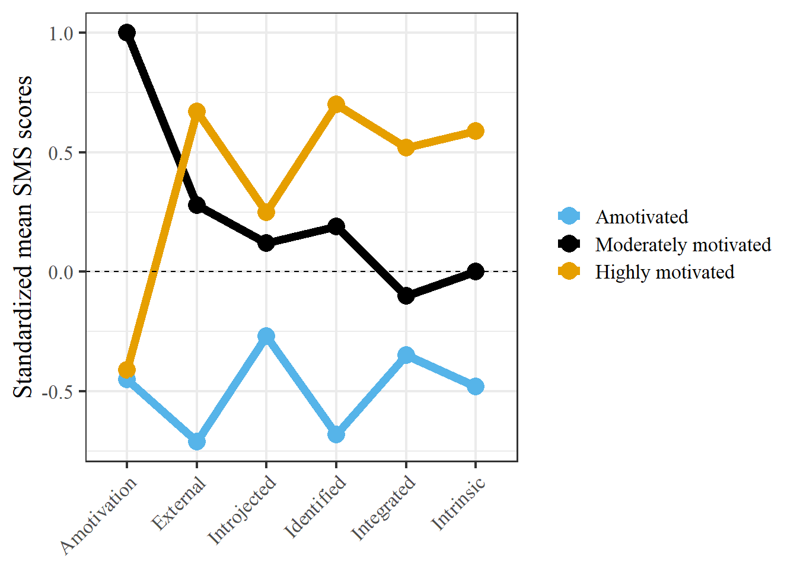

# **Motivation Journal**
### Rob Franken - Radboud University
Last compiled on `r format(Sys.time(), '%B, %Y')`

----

 

This lab journal is created for the motivation paper. It contains R code.       
All scripts can be found on [Github](https://github.com/robfranken/motivation)

 

----

# Background

Social network partners may motivate your sport behavior through a variety of mechanisms. I have devoted some extra attention to the measurement of motivation, as this remains a stumbling block in previous research (mainly due to the multidimensionality of the construct). A person-centered approach towards measuring motivation has gained a lot of popularity.

In the following, I will go through and apply Latent Profile Analysis. Latent Profile Analysis (LPA) tries to identify clusters of individuals (i.e., latent profiles) based on responses to a series of continuous variables (i.e., indicators). LPA assumes that there are unobserved latent profiles that generate patterns of responses on indicator items.   

I will go through an example of LPA to identify groups of athletes based on their motivations to take part in running. The data comes from the [ABS](https://easy.dans.knaw.nl/ui/datasets/id/easy-dataset:189895) panel study.     

Terminology note: terms like *clusters*, *profiles*, *classes*, and *groups* are used interchangeably, but are slightly different. In this example we'll stick to profiles to refer to a grouping of cases, following LPA terminology.

LPA is a Finite Mixture Model (FMM) [(see here)](https://stats.stackexchange.com/questions/130805/are-there-any-non-distance-based-clustering-algorithms/130810#130810). FMM is different from other clustering algorithms in that it offers a "model-based clustering", deriving profiles [*top-down*](https://en.wikipedia.org/wiki/Top-down_and_bottom-up_design) using a probablistic model that describes the distribution of the data (compared to a *bottom-up* approach in which clusters are derived using an arbitrary chosen distance measure).  

### Preview!

</a>

 

### Contributions using LPA
Here are some articles useful for learning about and applying LPA:

[Lindwall, M., Ivarsson, A., Weman-Josefsson, K., Jonsson, L., Ntoumanis, N., Patrick, H., ... & Teixeira, P. (2017). Stirring the motivational soup: within-person latent profiles of motivation in exercise. International Journal of Behavioral Nutrition and Physical Activity, 14(1), 1-12.](https://ijbnpa.biomedcentral.com/articles/10.1186/s12966-017-0464-4)

[Emm-Collison, L. G., Sebire, S. J., Salway, R., Thompson, J. L., & Jago, R. (2020). Multidimensional motivation for exercise: A latent profile and transition analysis. Psychology of sport and exercise, 47, 101619.](https://www.sciencedirect.com/science/article/pii/S1469029219303851)

[Martinent, G., & Decret, J. C. (2015). Motivational profiles among young table-tennis players in intensive training settings: A latent profile transition analysis. Journal of Applied Sport Psychology, 27(3), 268-287.](https://www.tandfonline.com/doi/pdf/10.1080/10413200.2014.993485?casa_token=tHVcBhF66NQAAAAA:lln9gSKMd2TSxDfVmwE6mcVL4lq5eOyh_aGnYwCYw5iWA3pKOfvMKNWMT0mnsm1mPzFkN2l6uJWDOic)

  

